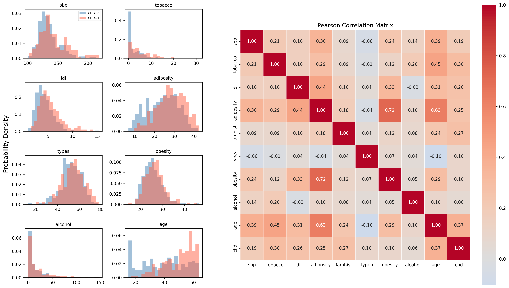
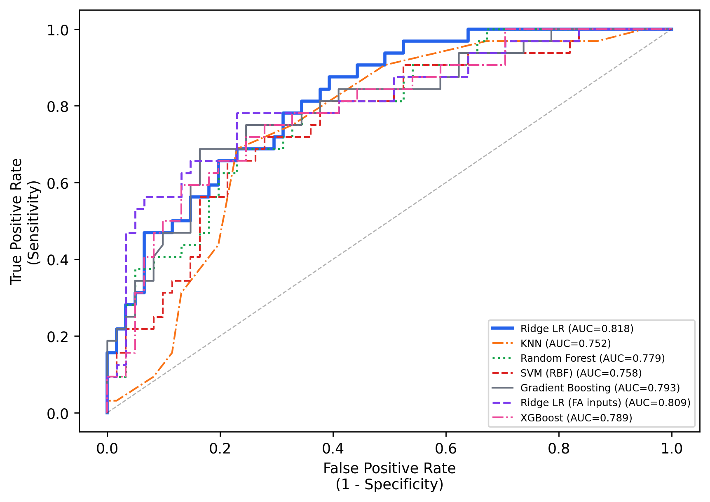
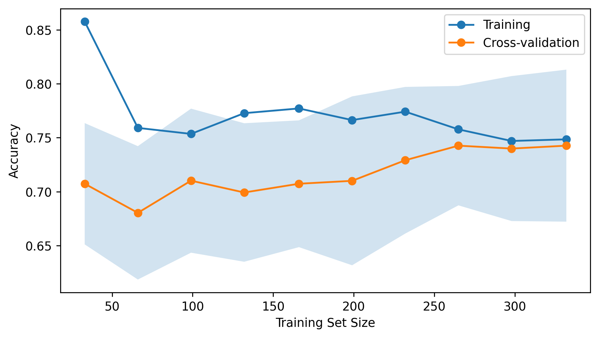
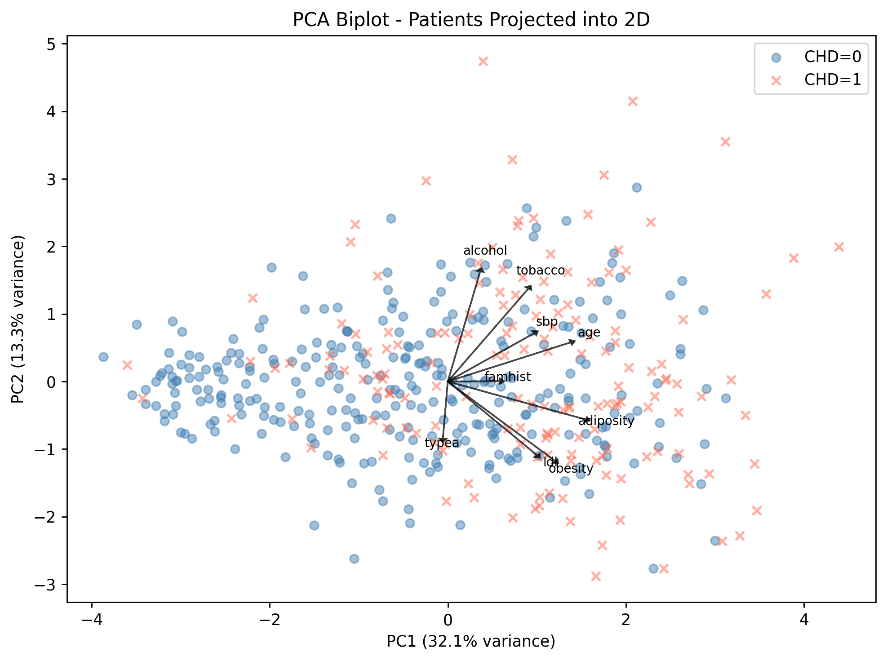
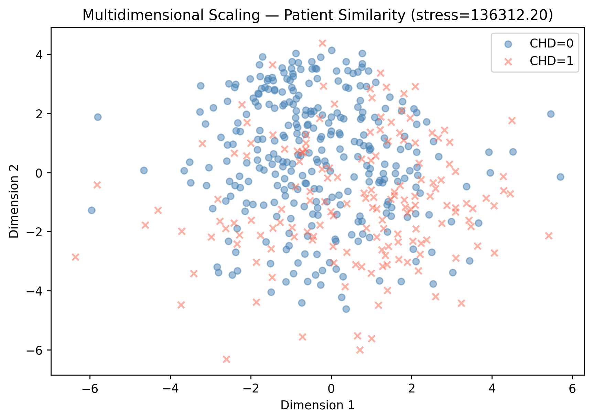
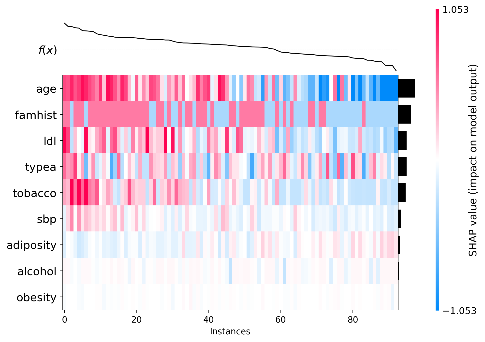
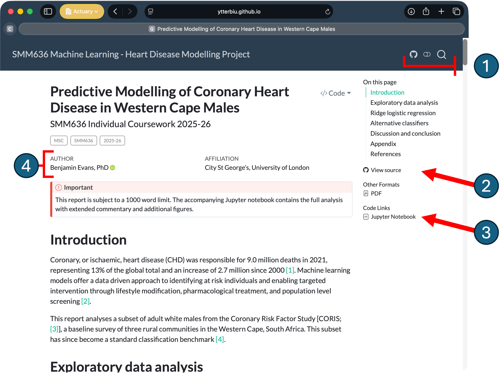

<!-- 
  Implementation note: Figures in this report are loaded as static PNGs
  pre-generated by the accompanying Jupyter notebook, and key numerical
  results are (mostly) hardcoded in the prose. This approach was adopted to
  minimise render times during the short turnaround for this project.
  A natural refinement would be to embed all model fitting and plotting
  directly within the QMD file using executable Python code blocks,
  allowing figures and statistics to compile dynamically from the data
  on each render. This would eliminate any risk of prose and code
  falling out of sync after parameter changes.
-->

```{r}
format_var_name <- function(x) {
  if (knitr::is_latex_output()) {
    paste0("\\texttt{", gsub("_", "\\\\_", x), "}")
  } else {
    paste0("<code style='color:#188038'>", x, "</code>")
  }
}
```

::: {.content-visible when-format="html"}
::: {.callout-important}
This report is subject to a 1000 word limit. The accompanying Jupyter notebook contains the full analysis with extended commentary and additional figures.
:::
:::

# Introduction {#sec-introduction}

Coronary, or ischaemic, heart disease (CHD) was responsible for 9.0 million
deaths in 2021, representing 13% of global total deaths and an increase of 2.7
million since 2000 [@who2024topcauses]. Machine learning models offer a data
driven approach to identify at risk individuals and enable targeted
intervention through lifestyle modification, pharmacological treatment, and
population level screening [@wu-deep-2025].

This report analyses a subset of adult white males from the Coronary Risk
Factor Study [CORIS; @rossouw1983]; a baseline survey of three rural communities
in the Western Cape, South Africa. This subset has since become a standard
classification benchmark [@hastie2009elements].

# Exploratory data analysis {#sec-eda}

The dataset contains 462 observations across nine clinical and behavioural
predictors with no missing values (@tbl-variables). The class distribution
exhibits a mild imbalance: 302 healthy controls (65.4%) versus 160 CHD-positive
cases (34.6%), yielding a baseline majority-class accuracy of 65.4% and an
imbalance ratio of 1.89. Because the effective severity of class imbalance
is mitigated by higher feature dimensionality [@zhu2020adjusting], this low
baseline IR combined with the rich feature space makes synthetic oversampling
unnecessary.

Individuals with CHD tend to be older with higher
`r format_var_name("tobacco")` and
`r format_var_name("ldl")` values (@fig-correlation-combined).
The correlation matrix reveals
substantial collinearity between `r format_var_name("adiposity")` and
`r format_var_name("obesity")` ($r = 0.72$), motivating regularisation in subsequent
modelling. Factor analysis identifies a latent metabolic/ageing factor (loading on
`r format_var_name("adiposity")`, `r format_var_name("age")`,
`r format_var_name("obesity")`, and `r format_var_name("ldl")`) alongside an
independent lifestyle factor (`r format_var_name("tobacco")`,
`r format_var_name("alcohol")`), confirming that the correlated body composition
variables measure overlapping aspects of the same underlying dimension.

Prior to modelling, family history was binary encoded and the data were
partitioned into an 80/20 stratified train/test split (369 training, 93 test).
Continuous features were $z$-standardised using training set parameters only
to prevent data leakage.


```{r}
#| label: tbl-variables
#| tbl-cap: "Clinical and behavioural predictor variables from the CORIS dataset [@rossouw1983]."
# also reference from ; @hastie2009elements

library(kableExtra)

heart_vars <- tibble::tribble(
  ~Variable,    ~Description,                                ~Type,
  "age",        "Age at onset (years)",                      "Continuous",
  "sbp",        "Systolic blood pressure (mm Hg)",           "Continuous",
  "tobacco",    "Lifetime cumulative tobacco use (kg)",      "Continuous",
  "ldl",        "Low-density lipoprotein (LDL) cholesterol", "Continuous",
  "adiposity",  "Adiposity measure",                         "Continuous",
  "obesity",    "Body mass index (kg/m$^{2}$)",              "Continuous",
  "alcohol",    "Current alcohol consumption",               "Continuous",
  "typea",      "Type-A behaviour score (Bortner scale)",    "Continuous",
  "famhist",    "Family history of heart disease",           "Binary",
)

heart_vars$Variable <- sapply(heart_vars$Variable, format_var_name)

heart_vars %>%
  kbl(
    booktabs = TRUE,
    escape = FALSE,
    align = c("l", "l", "l")
  ) %>%
  kable_styling(latex_options = "hold_position")
```

<!-- Note that the original Rossouw et al. (1983) paper doesn't specify units for ldl -->
<!-- and alcohol and the dataset documentation is silent on both. -->

{#fig-correlation-combined width=100% fig-pos="ht!"}


# Ridge logistic regression {#sec-ridge}

Logistic regression estimates CHD probability from a weighted combination of
patient features. An L2 (ridge) penalty was applied to address the
adiposity/obesity collinearity by constraining coefficient magnitudes and
distributing predictive weight across correlated features. 
An elastic net ($l_1$-ratio = 0.5)
confirms this: `r format_var_name("adiposity")`, 
`r format_var_name("obesity")`, and `r format_var_name("alcohol")` were driven 
to exactly zero with no loss of accuracy, confirming their information is 
already captured by the remaining predictors.
The regularisation strength $C$ was tuned via 10-fold stratified 
cross-validation (CV) over 20 logarithmically spaced candidates in $[10^{-4}, 10^{4}]$.
The optimal $C = 0.616$ yields a CV accuracy of 74.3% and test accuracy of
74.2%, with an area under the receiver operating characteristic curve (AUC) of
0.818. The near zero CV--test gap (0.001) indicates strong generalisation.

@fig-coefficients displays the standardised coefficients. Because inputs are 
standardised, coefficients are directly comparable.
`r format_var_name("age")` dominates (0.70) with each standard-deviation increase
(~15 years) doubling the odds of CHD ($e^{0.70} = 2.01$),
followed by `r format_var_name("famhist")` (0.43; $e^{0.43} =1.54\times$
odds), `r format_var_name("ldl")` (0.39), `r format_var_name("typea")` (0.36), 
and `r format_var_name("tobacco")` (0.31). `r format_var_name("obesity")` and
`r format_var_name("adiposity")` receive near-zero coefficients not because
body composition is irrelevant, but because the ridge penalty distributes
their shared variance given high collinearity ($r = 0.72$). SHAP analysis
aligns with this ranking, providing two independent methodologies that yield
the same feature importance structure.

![Ridge LR feature importance. (a) Standardised coefficients showing the direction and magnitude of each feature's linear contribution to CHD risk. Positive values (red) increase predicted risk. The small negative values (blue) for adiposity and obesity reflect multivariate adjustments holding highly collinear factors (like age) constant, rather than a true protective effect. (b) Mean absolute SHAP values confirming the same importance ranking via an independent method. (c) SHAP beeswarm plot showing how individual feature values (colour) drive predictions. Age, family history, LDL, and tobacco dominate across all three views.](fig/fig_ridge_coef_shap_bee.png){#fig-coefficients width=100% fig-pos="ht!"}


# Alternative classifiers {#sec-alternatives}

```{r}
#| label: tbl-comparison
#| tbl-cap: "Rationale and performance metrics for all classifiers tuned via 10-fold stratified CV on identical splits, including CV accuracy,  test accuracy, AUC, F1 score for the positive class, and difference between CV and test accuracy."

library(tibble)
library(kableExtra)

model_comp <- tribble(
  ~Model,                    ~Rationale,                                         ~`CV Acc.`, ~`Test Acc.`, ~AUC,   ~`F1 (CHD)`, ~`CV $-$ Test`,
  "Ridge LR",                "Interpretable linear baseline; handles collinearity", 0.743,   0.742,        0.818,  0.625,        "+0.001",
  "Ridge LR (FA)",           "Tests if dimension reduction aids classification",    0.688,   0.763,        0.809,  0.621,        "-0.075",
  "Gradient Boosting",       "Sequential residual correction; alternative nonlinear", 0.697, 0.763,       0.793,  0.645,        "-0.067",
  "XGBoost",                 "Regularised boosting with efficient tree learning",   0.710,   0.753,        0.789,  0.623,        "-0.043",
  "Random Forest",           "Captures nonlinear interactions via tree ensembles",  0.729,   0.710,        0.779,  0.509,        "+0.019",
  "Support Vector Machine (RBF)",               "Curved decision boundaries in higher-dimensional space", 0.748, 0.720,      0.758,  0.581,        "+0.028",
  "K-Nearest Neighbours",                     "Local similarity; tests neighbourhood structure",     0.743,   0.677,        0.752,  0.483,        "+0.065",
)

model_comp %>%
  kbl(
    booktabs = TRUE,
    escape   = FALSE,
    align    = c("l", "l", "c", "c", "c", "c", "c"),
    # linesep = c("", "", "", "\\addlinespace"),
    linesep = c(""),
    digits   = 3
  ) %>%
  kable_styling(
    latex_options = c("hold_position", "scale_down"),
    full_width    = FALSE,
    position      = "center"
  ) %>%
  column_spec(1, bold = TRUE, width = "3cm") %>%
  column_spec(2, width = "5cm") %>%
  row_spec(0, bold = TRUE) %>%
  row_spec(1, extra_latex_after = "\\midrule") 
```

@tbl-comparison summarises the classifiers evaluated alongside Ridge LR, each
testing a specific hypothesis about the data structure. Ridge LR achieves the
highest AUC (0.818) and the smallest CV--test gap (+0.001), indicating that CV
performance closely matches held-out performance. A Support Vector Machine (SVM)
attains the highest CV accuracy (74.8%) but drops to 72.0% on the test set,
consistent with overfitting on small samples [@asimit2022robust]. Random
Forest's optimal depth of 3 confirms that the underlying signal is low
complexity, further supporting the linear model. K-Nearest Neighbours (KNN)
performs worst, as expected when class-conditional distributions overlap in
moderate dimensions [@zhu2017orthogonal; @zhu2020separating]. Gradient Boosting
achieves the highest test accuracy (76.3%) but the lowest CV accuracy (69.7%),
producing a negative gap that suggests sampling variance on 93 test patients
rather than genuinely superior learning.

Nested CV (5 outer $\times$ 10 inner folds) yields $73.2\% \pm 4.3\%$ (mean
$\pm$ SD) for Ridge LR, confirming no optimistic bias. McNemar's test comparing
Ridge LR against each alternative yields $p$ values from 0.146 (KNN) to 1.000
(XGBoost), with no model reaching significance.
<!-- As established in @sec-eda, synthetic oversampling was not required. -->

# Discussion and conclusion {#sec-discussion}

{#fig-roc width=85% fig-pos="ht!"}

The accuracy ceiling of approximately 74% appears to be a property of the data
rather than a limitation of the models. The learning curve for Ridge LR
converges at full sample size (Appendix, @fig-apd-learning-curve), and
both PCA and MDS confirm that CHD positive and negative patients occupy heavily
overlapping regions of the feature space (Appendix, @fig-apd-pca-biplot; @fig-apd-mds).

Type A behaviour (`r format_var_name("typea")`) emerges as the fourth strongest
predictor in the ridge coefficients. A SHAP heatmap (Appendix,
@fig-apd-shap-heatmap) reveals that it operates independently of the other major
risk factors, with contributions scattered across the risk spectrum rather than
following the smooth gradient observed for `r format_var_name("age")` and
`r format_var_name("famhist")`. This suggests psychological stress acts through 
a distinct pathway, orthogonal to the metabolic and lifestyle factors identified
by factor analysis.

The preferred classifier depends on the clinical context. For population
screening, where maximising sensitivity at an acceptable false-positive rate 
(1-specificity) is the priority [@evans25], Ridge LR's superior AUC makes it the
strongest candidate. For diagnostic confirmation, Gradient Boosting offers
higher precision for the CHD class (0.67 vs 0.62). For deployment requiring
consistent performance on new patients, Ridge LR's near-zero CV--test gap and
interpretable coefficients make it the most reliable choice. The dominant risk
factors identified here (`r format_var_name("age")`, 
`r format_var_name("famhist")`, `r format_var_name("ldl")`, 
`r format_var_name("tobacco")`) are consistent with established cardiovascular
epidemiology across both European [@townsend-epidemiology-2022] and American
[@joseph-cardiovascular-2025] populations, suggesting the findings generalise
beyond this specific cohort.

One limitation is that the dataset's 35% CHD prevalence reflects case--control
sampling, whereas actual population prevalence was approximately 5%
[@rossouw1983], meaning predicted probabilities would systematically
overestimate risk without intercept correction. Future work could incorporate
Bayesian uncertainty quantification [@ke2024accelerating] for clinically
actionable risk intervals and apply the imbalance-dimensionality framework
[@zhu2018lrid] to larger cohorts to assess whether targeted resampling improves
minority-class recall.

Ridge logistic regression is recommended for this cohort (test
accuracy 74.2%, AUC 0.818). Age, family history, LDL cholesterol, and tobacco
consistently emerge as dominant risk factors across ridge coefficients,
permutation importance, SHAP values, and random forest importances,
demonstrating that these findings are robust rather than artefacts of any
single analytical approach.

<!-- ::: {.content-visible when-format="html"} -->

\newpage

# Appendix {.unnumbered}

## Supplementary methodology {#sec-appendix .unnumbered}

The following figures supplement the main analysis. The full analysis, both the
code used and a description of each step, is available as a Jupyter notebook
([`ml-smm636-a02-heart-disease.ipynb`](../ml-smm636-a02-heart-disease.ipynb))
and the dataset at [`data/heart-disease.csv`](../data/heart-disease.csv). All
results can be reproduced by running the accompanying Jupyter notebook.

```{r}
#| label: fig-apd-learning-curve
#| fig-cap: "Learning curve for Ridge LR. Training and CV accuracy converge at full sample size, indicating the ~74% ceiling is a property of the data."
#| out-width: "75%"

```

```{r}
#| label: fig-apd-pca-biplot
#| fig-cap: "PCA biplot. Patients projected into two dimensions with feature loading arrows. Heavy class overlap confirms the classification problem is genuinely difficult."
#| out-width: "70%"

```

```{r}
#| label: fig-apd-mds
#| fig-cap: "MDS projection. Patients mapped into two dimensions using pairwise distances. Class overlap is consistent with the PCA biplot (@fig-apd-pca-biplot), confirming that the difficulty is not an artefact of the projection method."
#| out-width: "70%"

```


```{r}
#| label: fig-apd-shap-heatmap
#| fig-cap: "SHAP heatmap sorted by descending predicted risk. Type-A behaviour contributions are scattered across the risk spectrum, unlike age and family history which transition smoothly."
#| out-width: "80%"

```

@fig-apd-learning-curve shows that additional training data would yield
only marginal improvement. @fig-apd-pca-biplot and @fig-apd-mds confirm,
from complementary perspectives, that the two classes occupy heavily
overlapping regions of the feature space. @fig-apd-shap-heatmap provides
patient level explanations and shows that `r format_var_name("typea")`
operates independently of the dominant metabolic and lifestyle risk factors.


## Reproducibility, accessibility, and word count {.unnumbered}

This report was created using Quarto. The complete analysis, including the
Python implementation, the Quarto source code, and the dataset
[`data/heart-disease.csv`](../data/heart-disease.csv), is available via a public
GitHub repository:

- Directory: <https://github.com/ytterbiu/SMM636-ML-a02-heart-disease>
- Juypter notebook: <https://github.com/ytterbiu/SMM636-ML-a02-heart-disease/blob/main/ml-smm636-a02-heart-disease.ipynb>

In addition to this document, an accessible, interactive HTML version of this
report is available via GitHub Pages:

- <https://ytterbiu.github.io/SMM636-ML-a02-heart-disease/>

The full modelling pipeline, including code and step-by-step commentary, is
documented in the accompanying Jupyter notebook
[`ml-smm636-a02-heart-disease.ipynb`](../ml-smm636-a02-heart-disease.ipynb). All
figures or supplemental analyses not explicitly shown in this appendix can be
reproduced using this notebook.

```{r, eval=TRUE}
#| label: fig-apd-quarto-site
#| fig-cap: "A screenshot of an accessible HTML copy of this report hosted as an interactive Quarto website. Annotations highlight key accessibility and reproducibility features: (1) navigation tools, including a dark mode toggle and search; (2) quick links to the Quarto source code and a downloadable PDF automatically rendered via GitHub Actions; (3) direct access to the full Jupyter notebook via the public GitHub page; and (4) author information, affiliation, and ORCID iD."
#| out-width: "90%"

```


```{r eval=TRUE}
#| label: fig-apd-notebook
#| fig-cap: "Partial view of the Jupyter notebook displayed via GitHub's native online preview. The notebook contains the complete analysis pipeline, including all data preprocessing, model fitting, hyperparameter tuning, and figure generation code alongside inline commentary."
#| out-width: "90%"

```


### Word count {.unnumbered}

The report Quarto (`.qmd`) file was used to produce a `.tex` file and the tool
`texcount` was used to count the words within each section. The output of
`texcount` is shown below:

```{bash}
#| echo: true
#| eval: false
$ texcount index.tex

File: index.tex
Encoding: utf8
Words in headers: 32
Words outside text (captions, etc.): 394
Number of headers: 10
Number of floats/tables/figures: 11
Number of math inlines: 15
Number of math displayed: 0
Subcounts:
  text+headers+captions (#headers/#floats/#inlines/#displayed)
  100+1+0 (1/0/0/0) Section: Introduction}\label{sec-introduction
  178+3+40 (1/2/3/0) Section: Exploratory data analysis}\label{sec-eda
  197+3+88 (1/1/7/0) Section: Ridge logistic regression}\label{sec-ridge
  172+2+34 (1/1/4/0) Section: Alternative classifiers}\label{sec-alternatives
  346+3+27 (1/1/0/0) Section: Discussion and conclusion}\label{sec-discussion
...
```

::: {.callout-important}
The total word count is `r 100+178+197+172+346`.
:::

### Generative AI declaration {.unnumbered}

Generative AI (GenAI) tools were used throughout this
coursework to assist with coding syntax, typesetting debugging, and
structural brainstorming. In practice, these tools functioned as an
interactive technical reference and advanced syntax checker. All
project decisions remained entirely the author's own.

**Tools used:** Claude Opus 4.6 (Anthropic) and Gemini 3 Pro (Google).

**Representative prompts:** The following illustrate the types of queries
submitted rather than an exhaustive list:

- "What is the syntax for combining a scaler and a classifier with `scikit-learn`?"
- "why is this Quarto cross-reference to a figure failing 
  to render correctly in the PDF output?"
- "how to force a specific aspect ratio and align a SHAP
  beeswarm plot next to a bar chart in `matplotlib`?"

<!-- **Nature of GenAI outputs:** -->

<!-- - Provided boilerplate Python syntax for data pipelines and complex -->
<!--   multi-panel visualisations. -->
<!-- - Helped identify and resolve specific LaTeX and Quarto rendering errors. -->

**Author declarations:**

- *Originality of text:* No AI-generated prose was copied into this
  submission. GenAI was used to iterate on the code structure and the final 
  text was written, edited, and verified entirely by the author.
- *Methodological ownership:* All substantive analytical decisions,
  including model selection, hyperparameter grid definitions, cross-
  validation strategies, and feature engineering, were made by the author.
- *Clinical interpretation:* All interpretations of model coefficients,
  SHAP values, and dataset characteristics were derived by the author.

<!-- ::: -->

\newpage

# References {.unnumbered}
